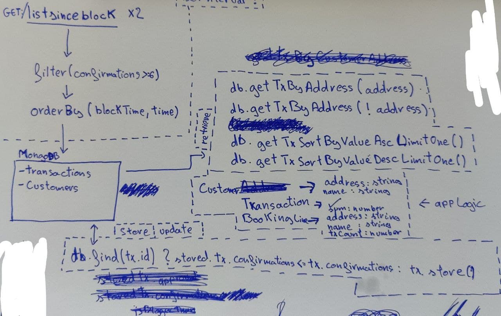

# Kobayashi Maru

Project created following instructions from [the challenge](./README-challenge.md). As the instructions were not very detailed, I have considered:

-   Transactions with less than 6 transactions are not worth store in the DB,
-   Files _transactions-1_ and _transactions-2_ renamed with the blockHash,
-   LTS versions used for both NodeJS MongoDB,
-   Looking forward for the next steps :thumbsup:

# Architecture

My focus was on optimization because when a lot of transactions leave the chains to the CEX and throughput is essential.

-   Irrelevant data is not stored on DB,
-   Operations done to the Repository are always executed on DB engine (if the db engine allows it),
-   Datasets size optimized to do not create very much system load,
-   Parallel requests to DB to improve response time,
-   Overall architecture very scalable,
-   Services/Providers easy to replace due inheritance...

```
.
├── assets                          // Original Files "transactions-1" and "transactions-2"
├── docker-compose.yml
├── docs                            // Relevant resources
├── migrations                      // MongoDB migrations (e.g: insert customers)
├── mocks                           // Duplicated transactions-1 and transactions-2 with the blockHash as name
├── src
│   ├── index.ts
│   ├── controllers
│   │   └── BlockchainController.ts
│   ├── models
│   │   ├── Customer.ts
│   │   ├── Deposit.ts
│   │   ├── ListSinceBlock.ts
│   │   └── Transaction.ts
│   ├── repository
│   │   ├── CustomersRepository.ts
│   │   ├── MongoDBRepository.ts
│   │   └── TransactionsRepository.ts
│   └── services
│       ├── blockchain
│       │   ├── BitcoinService.ts
│       │   ├── BlockchainServiceMock.ts
│       │   └── BlockchainService.ts
│       ├── CustomerService.ts
│       └── output
│           ├── ConsoleOutputService.ts
│           └── OutputService.ts
└── tests
    └── BlockchainController.test.ts
```

# Resources

Resources used to design the implementation

